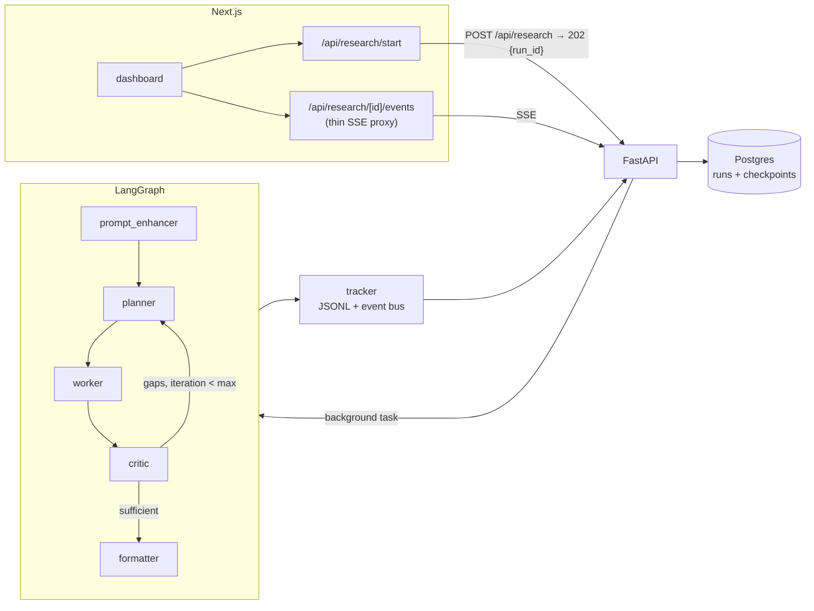

# Research Agent

[](https://github.com/serfcde/Research_Agent/actions/workflows/ci.yml)

A fault-tolerant multi-agent research pipeline. Give it a research prompt; it plans web research, executes searches concurrently, **judges its own coverage and replans to fill gaps**, then writes a cited report — while streaming every agent transition live to a tracing UI.

**Stack:** FastAPI · LangGraph (cyclic graph + Postgres checkpointing) · Groq (`llama-3.3-70b-versatile`) · Tavily · Next.js 14 · Postgres

## Why this isn't another agent wrapper

- **Self-correcting research loop** — a critic agent scores coverage after every research pass and routes the graph back to the planner with concrete gaps (capped at 2 iterations). "Why LangGraph?" — because the graph genuinely cycles.
- **Crash-safe runs** — graph state is checkpointed to Postgres per node transition (`thread_id = run_id`). `SIGKILL` the API mid-run, restart it, and the run **resumes from the exact node where it died** and finishes the report. Verified, not aspirational.
- **End-to-end distributed tracing** — one id correlates the browser's span tree, the Next.js SSE proxy, backend tracker events (JSONL + live event bus), and (optionally) per-request ids from a Pipelock LLM-traffic proxy.
- **CI-gated evaluation harness** — 15 fixed prompts scored by LLM judges (citation grounding, coverage) plus deterministic structure checks; `--compare` fails the build on a >10% quality regression. Cost and latency are measured from real token usage, not estimates.

## Architecture



`POST /api/research` returns `202 {run_id}` immediately; the pipeline runs as a background job. Progress streams over `GET /api/research/{run_id}/events` (SSE with replay for late subscribers), and results persist in Postgres — the API answers for finished runs even after a restart.

### Trace correlation

```
browser ──X-Trace-Id──▶ Next.js proxy ──X-Trace-Id──▶ FastAPI
                                                        │ run_id = trace_id = thread_id
                                                        ▼
                            tracker events (node_start/node_end, JSONL + SSE)
                                                        │
                       spans rebuilt in the UI ◀────────┘
```

The run id doubles as the trace id and the LangGraph thread id, so UI spans, backend node events, and checkpoints all join on one key.

## Quality & performance (eval baseline)

Measured by `make eval` on the fixed dataset (see [EVALS.md](EVALS.md)); baseline currently from a 2-prompt seed run — regenerate with `make eval-baseline`:

| Metric | Value |
|---|---|
| Citation grounding (LLM judge) | 0.78 |
| Coverage (LLM judge) | 0.65 |
| Structure checks | 1.00 |
| Latency p50 | 11.9 s |
| Cost per report (real token usage) | ~$0.004 |
| Replan rate | 100% of baseline runs used the critic loop |

`make eval-check` exits non-zero if grounding/coverage/structure regress >10% vs `evals/baseline.json`.

## Quick start

### Prerequisites

- Python 3.12+, Node 20+
- [Groq](https://console.groq.com) and [Tavily](https://tavily.com) API keys (both have free tiers)
- Postgres (optional — enables durable runs + crash recovery; in-memory fallback otherwise)

### Backend

```bash
cp .env.example .env        # fill in GROQ_API_KEY, TAVILY_API_KEY
python3 -m venv .venv && source .venv/bin/activate
pip install -r requirements-dev.txt
make dev                    # http://localhost:8000/docs
```

### Frontend

```bash
cd frontend
npm install
npm run dev                 # http://localhost:3000
```

### Docker (app + Postgres)

```bash
docker compose up --build
```

### Try it

```bash
curl -X POST localhost:8000/api/research \
  -H "Content-Type: application/json" \
  -d '{"prompt": "Compare solid state batteries vs lithium ion batteries"}'
# → 202 {"run_id": "..."}

curl -N localhost:8000/api/research/<run_id>/events   # live node transitions
curl localhost:8000/api/research/<run_id>             # status + report
```

Or use the dashboard at `localhost:3000` and watch the workflow graph light up — including the critic sending the planner back for a gap-filling pass.

### Crash recovery demo

```bash
docker compose up -d
curl -X POST localhost:8000/api/research -H "Content-Type: application/json" -d '{"prompt": "..."}'
docker kill research-agent          # SIGKILL mid-run
docker compose up -d                # restart
# logs: "Resuming interrupted run ... resuming at node(s) ('worker',)"
```

## Tests, lint, evals

```bash
make test        # 60 tests, hermetic (no API keys, no network)
make lint        # ruff
make eval        # full eval suite (needs API keys)
make eval-check  # fail on >10% regression vs baseline
```

CI (GitHub Actions) runs ruff + the test suite (with a Postgres service container), frontend typecheck/lint/build, and a Docker image build on every push/PR.

## Configuration

All settings via environment variables (see `.env.example`):

| Variable | Purpose | Default |
|---|---|---|
| `GROQ_API_KEY` | LLM (required) | — |
| `TAVILY_API_KEY` | Web search (required) | — |
| `SERPAPI_API_KEY` | Search fallback (optional) | — |
| `GROQ_MODEL` | Model id | `llama-3.3-70b-versatile` |
| `DATABASE_URL` | Postgres for runs + checkpoints | empty = in-memory |
| `API_KEYS` | Comma-separated `X-API-Key` values | empty = auth off |
| `CORS_ORIGINS` | Allowed origins | `http://localhost:3000` |
| `PIPELOCK_PROXY_URL` | Optional local LLM-traffic proxy | off |

## Deployment

Configs included for a free-tier deploy: `railway.json` (backend + Postgres on Railway) and a standard Next.js setup for Vercel. See [DEPLOYMENT.md](DEPLOYMENT.md).

Frontend (Vercel) env vars: `BACKEND_API_URL`, `BACKEND_API_KEY` (server-side only — never exposed to the browser).

## Project layout

```
app/
  agents/         prompt_enhancer, planner (+gap mode), worker, critic, formatter
  graph/          LangGraph graph, nodes, state, tracker (JSONL + SSE event bus)
  services/       orchestration (background jobs, crash resume), run_store, llm_service
  tools/          web_search (Tavily + SerpAPI fallback), file_writer
  api/            routes (202 job API, SSE), auth dependency
evals/            dataset, LLM judges, run_evals CLI, baseline
frontend/         Next.js dashboard: live workflow graph, span tree, report viewer
tests/            60 hermetic tests (agents mocked at the class boundary)
```

## Resume bullets (maintainer's notes)

> - Built a self-correcting multi-agent research pipeline (FastAPI + LangGraph) where a critic agent scores coverage and cycles the graph back to planning; replans occurred in **{replan_rate}** of eval runs and raised judged coverage measurably per pass.
> - Engineered crash-safe execution: per-node Postgres checkpointing with automatic resume — a SIGKILLed run restarts at the exact failed node; **~${cost}/report at p50 {p50}s**, measured from real token usage.
> - Shipped a CI-gated LLM evaluation harness (citation-grounding + coverage judges over a fixed 15-prompt dataset) that fails builds on >10% quality regression, plus end-to-end distributed tracing correlating browser spans, SSE node events, and LLM-proxy request ids on a single trace id.

Fill the placeholders from your latest `make eval` run.
